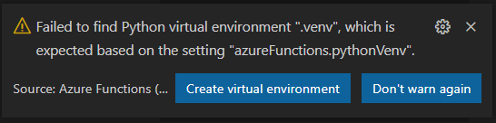
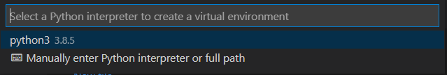
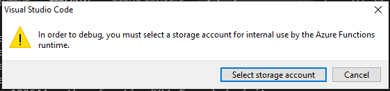
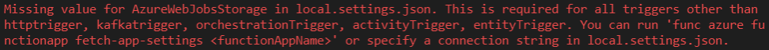
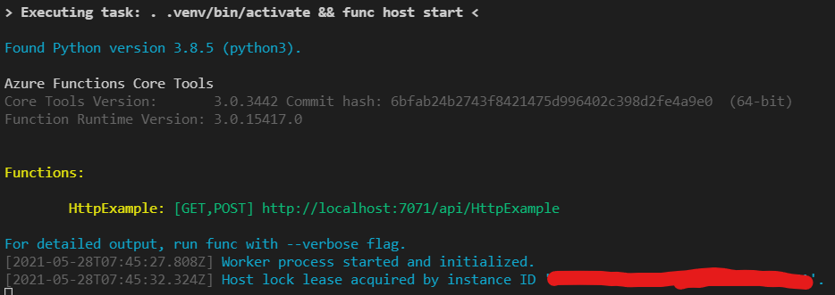

# PyFunc Playground

This repository will allow us to share code, questions, and research related to using Azure Functions with Python.

## Questions

- Is there a subscription we should be using going forward?

- Do we need Durable functions?

- What libraries do we need to use? ex. Pandas, Numpy

## Investigations

- Can we get common Python libraries working? Pandas, Numpy
    Yes, as long as the library supports linux.

- Can we get Azure Cognitive Search client library for Python working?
    - https://github.com/Azure-Samples/azure-search-python-samples
    - https://github.com/Azure/azure-sdk-for-python/tree/azure-search-documents_11.1.0/sdk/search/azure-search-documents/samples
    ANSWER:
    We can import the sdk, however we need some secrets to access ACS.
    - index_name (not a secret?)
    - SEARCH_ENDPOINT (not a secret?)
    - SEARCH_API_KEY
    How to store secrets:
    - https://docs.microsoft.com/en-us/azure/azure-functions/security-concepts#managing-secrets
    - TLDR; Application Settings, specifically in the `local.settings.json` for local dev, and somewhere else if deployed on Azure. Otherwise self-managed with Azure Key Vault.

- What versions of Python are supported?
    - ANSWER: https://docs.microsoft.com/en-us/azure/azure-functions/supported-languages#languages-by-runtime-version
    - ANSWER: 3.8 should cover everything we need (latest, non-preview version)

- Can we deploy and run code?
    - Locally?
        ANSWER: Yes.
        
        ### WSL+VS Code Steps:
        ```bash
        # 1. Clone the repo
        git clone https://github.com/plasne/pyfunc-playground.git
        ```

        ```bash
        # 2. Open the directory in VS Code
        code ./pyfunc-playground
        ```

        ```bash
        3. Select, `Create virtual environment` on the following pop-up.
        ```
        

        ```bash
        4. Select the python interpreter, (3.8.x recommended)
        ```

        

        **Note:** One may incur the following pop-up, requesting a storage account:
        
        
        **TLDR;** Timer triggers, among others, require a storage account to run. Otherwise this error will occur.
        

        ```bash
        5. Congratulations, you should see the following terminal window!
        ```
        
        

        
    - In Azure?
        Answer: Yes
        Select your subscription, then your function app that you created via the portal.
        Right-click and select `Deploy to Function App...`


    - Using CLI?

- Can we host as web service?

- Can we do an HTTP GET from a webservice?

- Can we do an HTTP POST to a web webservice?

- Can we save to blob storage?

- Test performance of an operation from cold and warm and document it.

- What does integration with AppInsights look like?

## Links

- https://docs.microsoft.com/en-us/azure/azure-functions/functions-reference
- https://github.com/Azure/azure-functions-templates
- https://docs.microsoft.com/en-us/azure/azure-functions/functions-best-practices
- https://docs.microsoft.com/en-us/azure/azure-functions/durable/durable-functions-overview?tabs=csharp
- https://docs.microsoft.com/en-us/azure/azure-functions/functions-scale